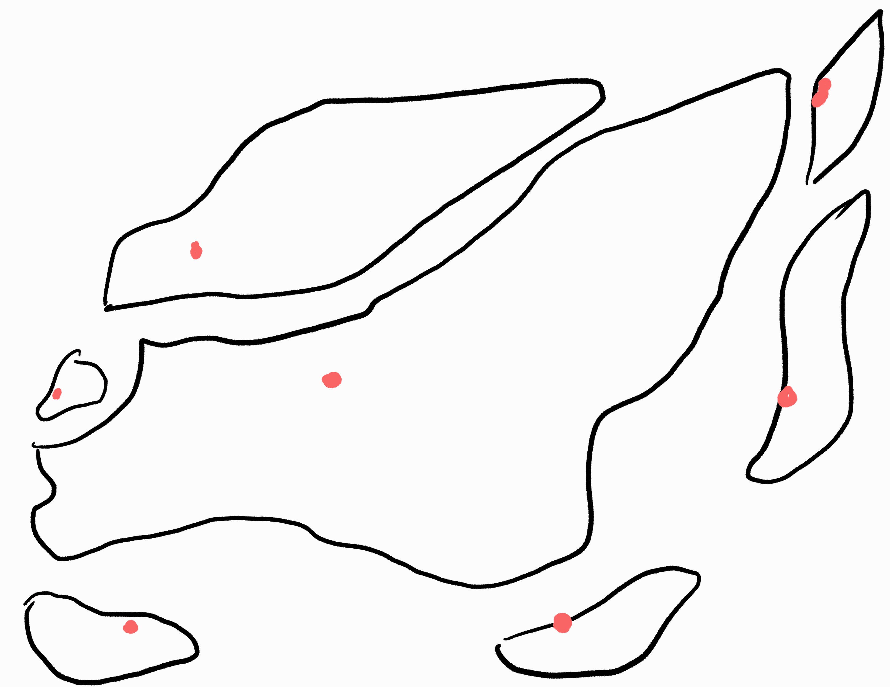
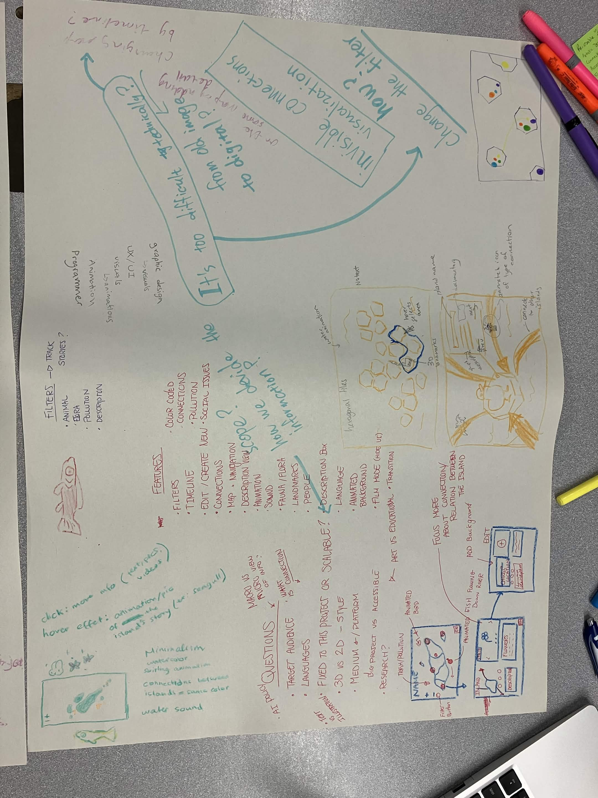
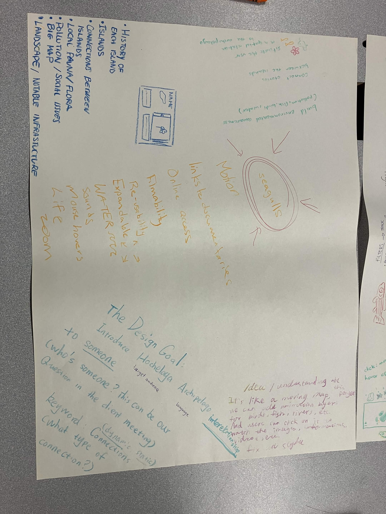

# CART470JOURNAL

## (NEW) WEEK 3: Visual Prototyping

After meeing up with Elizabeth Miller, we got a loooot of information and ideas of what to implement into our final product.
However, each new idea that were being brought up kind of conflicted with eachother design-wise.
For example, we had an idea of travelling to each island as a png of a unit that exists there (bird, ferry, snake, human), but if we want the map to have lined connection based on the type of topics, these two wouldn't look well together.

So we decided to try to convey our vision of what the website would look like either through canva or other media.
We also made it a point to elaborate on these 4 points:
- Navigation
- Information Presentation
- Visual / Art
- Connections

I decided to do a little hand-drawn animation, because that felt quicker for me to explain, especially when I am focusing more on the technical aspects of it, as I promised to make the app scalable and easy for the client to add more information.

**Overview Map:**

you see all the "Port" Pins where you can spawn at

**Navigation:**

Click on the nodes to navigate towards them, clicking on it again will confirm and do things (land / open description)

**Information presentation:**
Nodes on an island can be color-coded to represent different types of Nodes:

    Ports
    Pollution
    Island Description
    Etc

These nodes' colors should remain consistent for all islands

When approaching a informational node, it will pop up a little sign and users can click on them to access the Description View.

**Visuals / Art:**

    Nodes (Colored Circles, maybe with a Letter inside (for the colorblind))
    Landing on an island changes your character image
    Description View:
        Vertical List of bubbles that changes the view
        Big Image
        Side description

**Connections:**

    Colored Nodes
        We can maybe try having colored nodes from different island connect to each other
    Port Nodes
        Some that are innaccessible by boat can probably use port nodes between islands

---

## WEEK 2: Brainstorming

For our first brainstorming task that we did together, we suggested that everyone take 20 minutes reading through all the given resources and write down what we felt was important to include in the project.

Some things that I noted down include:
- History of each Island
- Island
- Connections between islands
- Historical figures 
- Scalable app
- Local Fauna and Flora
- Pollution, Social Issues
- Zoom out node map?
- Connected segmented maps
- Big Map
- Landscape
- Notable Buildings / Infrastructure

We then took turns talking and elaborating about what we found important, and then drawing out an Interface that to get a clearer idea of how the project will look like.
Considering that the project description included a lot of references and a clear goal of an Interactive Map, our biggest concern is the scope and finer details of what our client wants.

Such as:
- Who are our target audience?
- What context will this be used in?
- Would they want it to be more artistic or education?
- Do they want it to be a downloadable app or web browser accessible? 
- Are they gonna provide us with information about the archipelago or will we have to plan for research time?
- Do they want a scalable Map (they can add more information themselves / reuse for other projects), or a fixed map for this specific project?
- Do they want to have different languages?
- Do they want all the island displayed or to follow along with a select amount, focusing on the story of a set of islands

We will probably have more to talk and do once we meet up with our client and have a clearer idea of what the project will look like.

